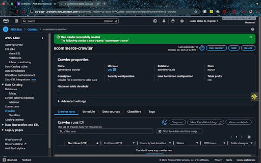

# AWS Core Services Lab - ITCS 6190/8190

**Name:** Devanand Nagendrababu 
**ID:** 801395558
**Date:** 10/28/2025

## Overview

This lab implements an AWS data analytics pipeline using S3, Glue, CloudWatch, and Athena to analyze e-commerce sales data.

**Dataset:** [Amazon Sales Data - Kaggle](https://www.kaggle.com/datasets/thedevastator/unlock-profits-with-e-commerce-sales-data)

## Architecture
```
CSV File → S3 Bucket → Glue Crawler → Data Catalog → Athena Queries → Results
                            ↓
                      CloudWatch Logs
```

## Implementation Steps

### 1. S3 Buckets Created
- `itcs6190-raw-data-[username]` - Raw CSV storage
- `itcs6190-processed-data-[username]` - Query results

### 2. IAM Role Configuration
- **Role:** `GlueCrawlerRole-ITCS6190`
- **Policies:** AWSGlueServiceRole, AmazonS3FullAccess


### 3. Glue Setup
- **Database:** `ecommerce_db`
- **Crawler:** `ecommerce-crawler`
- **Table:** `rawdevanand_handson` (auto-generated schema)




### 4. CloudWatch Monitoring
Monitored crawler execution logs in `/aws-glue/crawlers`


### 5. Athena Queries
Executed 5 analytical queries on the cataloged data.


## SQL Queries & Results

### Query 1: Cumulative Sales Over Time
**File:** [Query_1_cumulative_sales](Query_1_cumulative_sales)

Calculates running total of sales for 2022.


---

### Query 2: Geographic Hotspot Analysis
**File:** [Query2_geo_hotspot](Query2_geo_hotspot)

Identifies states with lowest sales performance.


---

### Query 3: Category & Style Performance
**File:** [Query3_sales_performance](Query3_sales_performance)

Analyzes sales by product category and style.


---

### Query 4: Top 3 Products by Category
**File:** [query4_top_3_sku](query4_top_3_sku)

Ranks top 3 best-selling SKUs in each category.


---

### Query 5: Sales Sequence Analysis
**File:** [query5_daily_sales](query5_daily_sales)

Shows cumulative sales and moving averages by order sequence.


---

## Screenshots Gallery

### AWS Infrastructure


## Key Challenges

**Challenge 1:** Date format was MM-DD-YY string, not date type  
**Solution:** Used `DATE_PARSE(date, '%m-%d-%y')` and string matching

**Challenge 2:** Column names with hyphens (e.g., ship-state)  
**Solution:** Wrapped in double quotes `"ship-state"`

**Challenge 3:** Single-day dataset limited time-series analysis  
**Solution:** Modified Query 5 to use order sequence instead of months

## Key Learnings

- Glue crawlers automatically detect schema, saving manual effort
- IAM roles provide secure, temporary access without credentials
- Athena's serverless model is cost-effective for ad-hoc queries
- CloudWatch essential for debugging and monitoring
- S3 separates raw/processed data following data lake best practices

## Repository Structure
```
├── README.md
├── Query_1_cumulative_sales
├── Query2_geo_hotspot
├── Query3_sales_performance
├── query4_top_3_sku
├── query5_daily_sales
├── cloudwatch.png
├── crawler.png
├── db_glue.png
├── first_describe_command.png
├── iam_creation.png
├── image.png
├── query_1_result.png
├── query_2.png
├── query_3.png
├── query_4.png
└── query_5.png
```

## Cleanup

1. Delete Glue crawler and database
2. Empty and delete S3 buckets
3. Delete IAM role

---

**Course:** ITCS 6190/8190 - Cloud Computing for Data Analysis, Fall 2025
